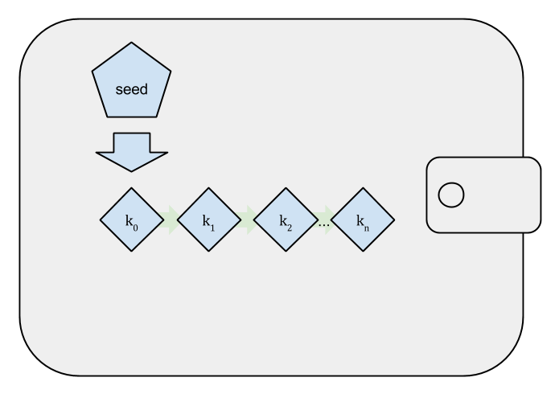

# Key, Addresses, Wallets

## 1. Giới thiệu.
* Quyền sở hữu của bitcoin được thiết lập thông quá các khóa số (key), địa chỉ bitcoin(address) và chữ ký số (signature). Các khóa số không thực sự được lưu trữ trên mạng bitcoin mà thay vào đó sẽ được lưu trong ví (file hoặc cơ sở dữ liệu). Các khóa số trong ví hoàn toàn độc lập với giao thức bitcoin ( nghĩa là các ví của người dùng có thể tạo và quản lý chung mà không cần tham chiếu đến blockchain hay kết nối internet) do đó đảm bảo độ tin cậy và kiểm soát phi tập trung, xác nhận quyền sở hữu và mô hình bảo mật bằng mật mã.
* Hầu hết các giao dịch bitcoin đều đòi hỏi một khóa số hợp lệ để được đưa vào blockchain. Khóa số được tạo ra bằng khóa bí mất  do đó ai có bản sao khó bí mật đó thì đều có thể kiếm soát bitcoin.
* Các khóa bao gồm khóa riêng (bí mật) và khóa công khai. Các khóa riêng này rất ít khi được người dùng bitcoin nhìn thấy, chúng được lưu trữ bên trong tập tin ví và được quản lý bởi phần mềm ví bitcoin. Còn khóa công khai sẽ dùng để mã hóa tạo ra bằng địa chỉ bitcoin của người dùng.
## 2. Mật mã khóa công khai và tiền điện tử (Public key cryptography and crypto-currency)
* Bitcoin sử dụng mật mã hóa công khai để tạo ra cặp khóa kiểm soát quyền truy cập vào bitcoin.
* Bitcoin sử dụng phép toán *Elliptic curve* trong việc tạo ra key: 
	* Public key (khóa công khai): dùng để nhận bitcoin và có thể tính toán từ private key.
	* Private key (khóa riêng) : dùng để tạo chữ ký (signature) nhận - chi bitcoin.
* Signature được tạo ra từ private key có thể xác nhận bằng public key mà không cần đến private key.
* Khi giao dịch chỉ cần đưa ra khóa công khai và chữ ký.

## 3. Private and Public Keys.
* Quy trình tạo ra key:
	* Tạo ngẫu nhiên ra một số ( private key).
	* Từ private key, dùng phép toán **elliptic curve** để sinh ra public key.
	* Từ public key sử dung hàm băm một chiều sinh ra bitcoin address.
	* Qui trinh là một chiều do đặc tính của phép toán.
	!Create Key](image/create_key.png)

* Tạo private keys:
	* Khóa riêng là một số được chọn ngẫu nhiên. Nó sẽ được dùng để kiếm soát tất cả các tài khoản liên kết với địa chỉ bitcoin nên cần phải giữ bí mật và an toàn.
	* Bitcoin sử dụng các trình tạo số ngẫu nhiên của hệ điều hành cơ bản để tạo ra 256 bit entropy ngẫu nhiễn. Khóa riêng là 1 số bất kỳ trong khoảng từ ( 1 đến n-1, n = 1,158*10^77)
	* Ví dụ một khóa hiển bị dưới dạng số thập lục phân: 1E99423A4ED27608A15A2616A2B0E9E52CED330AC530EDCC32C8FFC6A526AEDD

* Khóa public keys:
	* Khóa công khai được tính từ khóa riêng sử dụng phép nhân khóa riêng với đường cong elliptic và không thể đảo ngược lại. K = k* G . Trong đó k là khóa riêng, K là khóa công khai và G là điểm cơ sở ( điểm phát ) trên đường cong.

* Địa chỉ bitcoin (Bitcoin Addresses)

	* Địa chỉ Bitcoin là một chuỗi các chữ số và ký tự có thể đươc chia sẻ với bất kỳ ai muốn gửi tiền cho bạn.

	* Nó được tạo ra từ khóa công khai (public key) thông qua việc sử dụng băm mã hóa 1 chiều **hash algorithm** và bắt đầu bằng chữ số '1'.

	* Các hàm băm mật mã được sử dụng rộng trong bitcoin để:
		* Tạo địa chỉ bitcoin
		* Tạo địa chỉ script
		* Trong thuật toán PoW

	* Các tạo ra địa chỉ bitcoin A: bắt đầu với khóa công khai K tính toán hàm băm SHA 256 và sau đó tính giá trị hàm băm RIPEMD160 của kết quả tạo ra 1 số 160bit. Cuối cùng là *Encode* theo *Base58Check* 
		A = RIPEMD160( SHA256(K))
		* Cụ thể hơn: sử dụng preix là 0x00
		*public_key_hash = RIPEMD160(SHA256(public_key))*
		*checksum = SHA256(SHA256(prefix + public_key_hash)).to_hex.slice(0, 4) # Lấy 4 byte đầu*
		*address = Base58(prefix + public_key_hash + checksum)*
		

	* Base58 và Base58Check Encoding
		* **Base58**: là 1 tập hợp các chữ cái ( hoa và thường) và các chữ số mà không có (0, O, i, I ).
		* **Base58Check** :
			* là 1 định dạng mã hóa của **Base58** để tăng cường bảo mật chống lại lỗi chính tả hoặc lỗi mã phiên.
			* Cách chuyển đổi dữ liệu sang **Base58Check**: 
				* Thêm tiền tố để phân biệt loại dữ liệu
				* Sử dung hàm băm SHA256 2 lần ( tiền tố + dữ liệu)
				* checksum = SHA256(SHA256(tiền tố + dữ liệu))
				* Lấy 4 byte đầu tiên của kết quả nối vào cuối dữ liệu để kiểm tra lỗi.
				

## 4. Wallets (Ví)

Ví: 
* Ở mức người dùng, thì ví là một ứng dụng phục vụ như giao diện người dùng chính. Nó giúp kiểm soát quyền truy cập vào tiền của người dùng, quản lý khóa và địa chỉ, theo dõi số dư và ký giao dịch
* Ở mức lập trình viên thì ví là cấu trúc cơ sở dữ liệu được sử dụng để lưu trữ và quản lý khóa của người dùng.

Gồm 2 loại: 
* Ví xác định
* Ví không xác định
1. Ví không xác định (Non-Deterministic Wallets)
* là bộ sưu tập các khóa bí mật được tạo ngẫu nhiên hay còn được gọi là JBOK ( Just a Bunch Of Keys).
* Loại ví này dần được thay thế bằng ví xác định vì chúng cồng kềnh trong việc quản lý, sao lưu và thêm do cần quán lý nhiều khóa và yêu cầu phải sao lưu thường xuyên.

2. Ví xác định ( Deterministic (Seeded) Wallets)
* Ví sẽ chứa các khóa riêng từ 1 seed thông qua việc sử dụng hàm băm 1 chiều tạo ra.
* Seed ở đây là 1 số được tạo ngẫu nhiên kết hợp với các dữ liệu khác để lấy các khóa riêng.

3. Một số tiêu chuẩn ví (wallets): 
* Mnemonic code words ( các từ mã nhớ), dựa trên tiêu chuẩn BIP-39
* HD wallets, dựa trên tiêu chuẩn BIP-32
* Multipurpose HD wallet structure ( cấu trúc ví), dựa trên tiêu chuẩn BIP-43
* Multicurrency and multiaccount wallets ( đa tiền tệ và đa tài khoản), dựa trên tiêu chuẩn BIP-44

4. Mnemonic Code Words
* **Mnemonic Code** là các chuỗi từ Tiếng Anh đại diện cho mã hóa 1 số ngẫu nhiên được sử dụng như là 1 seed để tìm ra 1 ví xác định. Trình tự các từ đủ để tạo lại seed và từ đó tạo lại ví và tất cả các khóa
* **Mnemonic Code** hiển thị 1 chuổi 12-24 từ khi lần đầu tiên tạo ví.
BIP0039 định nghĩa tạo mnemonic code và nguồn:
* Tạo 1 chuỗi ngẫu nhiên từ 128-256 bits.
* Tạo 1 checksum chuỗi ngẫu nhiên bằng cách lấy 1 vài bit đầu tiên của hàm băm SHA256 của nó.
* Thêm checksum vào cuối chuỗi của nó
* Chia chuỗi thành các phần 11 bit, sử dụng chúng để lập chỉ mục 1 từ điển gồm 2048 từ được xác định trước
* Đưa ra 12-24 đại diện cho mnemonic code

5. Hierarchical Deterministic Wallets (BIP-32)
* Ví **Deterministic** phát triển để giúp dễ dàng lấy được nhiều khóa từ 1 seed duy nhất và hình thức tiên tiến của ví **Deterministic** là ví **Hierarchical Deterministic (ví HD)**
* Ưu điểm:
	* Cấu trúc cây được sử dụng để thể hiện ý nghĩa tổ chức bổ sung (các nhánh thực hiện các công việc khác nhau)
	* Tạo các khóa công khai mà ko cần truy cập vào các khóa riêng tương ứng

* HD wallet creation from a seed ( Tạo ví từ Seed)

* Private child key derivation ( phát sinh khóa con riêng)

* Public child key derivation

6. Khóa nâng cao và địa chỉ (Advanced Keys and Addresses)
* Encrypted Private Keys
	*Private key phải được lưu trữ kĩ càng, riêng tư.
	*BIP0038 đưa ra một phương án mã hóa private key với một passphrase (giống Linux ssh-agent ?), sau đó mã hóa Base58, kết quả này có thể được công khai.

* Pay to Script hash (P2SH) and Multi-Sig Addresses.
	* Bitcoin Address bắt đầu bằng "3" được gọi là P2SH (hoặc Multi-Signature Address).

	* Bằng cách mã hóa với prefix 5, ta sẽ được address bắt đầu bằng "3".

	* Không như tx gửi Bitcoin đến Bitcoin address "1...", nó sẽ gửi đến địa chỉ "3...", mà sẽ cần nhiều thông tin hơn ngoài public key hash và signature.

	* Như tên gọi, nó cần nhiều hơn 1 signature để xác nhận, cụ thể là M (gọi là threshold) nhỏ hơn hoặc bằng N (N key). Từ đó N key kia đều có thể dùng được các transaction output này (tương đương tài khoản chung).

* Vanity Addresses
	* Địa chi ảo là địa chỉ bitcoin hợp lệ chứa thông điệp có thể đọc của con người.
	* Thử tất cả khóa bí mật tạo ra địa chỉ ảo đến bao h tìm thấy địa chỉ ảo trùng với mô hình đặt ra thì dừng lại ("Kid" mất 3s tìm kiếm).
	* Có thể bị hacker tấn công thay đổi địa chỉ ảo bằng 1 địa chỉ khác.
	* Địa chỉ có mô hình kí tự càng nhiều thì càng bảo mật
