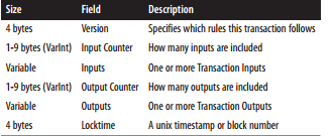
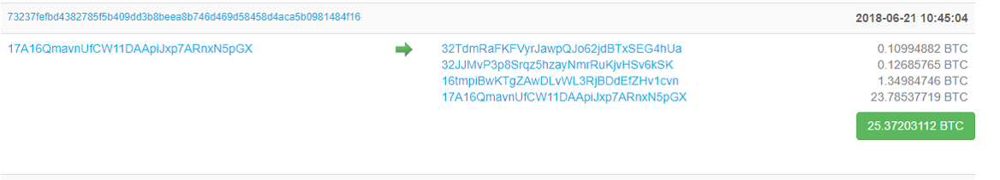

# Transactions (Giao dịch)

## 1. Giới thiệu chung.
* Giao dịch là phần quan trọng của hệ thống bitcoin
* Các thứ khác trong hệ thống bitcoin sẽ đảm bảo các giao dịch được tạo ra, được lan truyền trên mạng, được xác nhận và được thêm vào sổ cái giao dịch (blockchain).
* Giao dịch là một cấu trúc dữ liệu được mã hóa để truyền giá trị giữa những người tham gia vào hệ thống.
* Vòng đời của giao dịch:
    - Tạo giao dịch
    - Ký bởi người gửi
    - Xác thực và lan truyền lên mạng
    - Ghi vào block
* Sau khi được ghi lại trong blockchai và được xác nhận bởi một số block thì giao dịch được coi là hợp lệ và tồn tại trong sổ cái bitcoin và bắt đầu một vòng tuần hoàn mới.

## 2. Tạo giao dịch ( Create transaction)
* Giao dịch có thể tạo online hoặc offline hoặc online bởi bất cứ ai (node), bất cứ đâu nhưng sau đó phải được xác thực bởi chữ ký của người sở hữu.
* Giao dịch cần chứa đầy đủ thông tin để có thể thực hiện giao dịch.
* Sau khi đươc xác thực, giao dịch sẽ được quảng bá ( lan truyền ) tới tất cả các node trên mạng.

## 3. Quảng bá giao dịch trên mạng bitcoin (Broadcasting)
* Giao dịch cần được lan truyền trên mạng để được xác thực và thêm vào blockchain
* Người gửi không cần tin tưởng toàn bộ các nút mà nó lan truyền tới mà chỉ cần ít nhất 1 nút đảm bảo đề lan truyền. 
* Giao dịch không chứa các thông tin nhạy cảm và có thể truyền trên bất kỳ đường truyền mạng nào.

## 4. Lan truyền giao dịch (Propagating transaction)
* Các giao dịch được gửi đến các nút khác để xác thực.
* Nếu giao dịch hợp lệ thì nút đó sẽ lan truyền giao dịch đến các nút mà nó kết nối, trả về thông điệp thành công.
* Nếu giao dịch không hợp lệ nút đó sẽ tự chối giao dịch và trả về thông điệp từ chối.
* Mạng bitcoin là mạng peer to peer, mỗi nút sẽ liên kết vơi một vài nút khác. Thông điệp sẽ được truyền đến các nút mà nó kết nối.
* Một nút khi nhận được giao dịch đã xác thực sẽ gửi tới 3 - 4 nút lân cận. Bằng cách đó, trong vài giây giao dịch sẽ được lan truyền trên toàn bộ mạng.
* Các nút sẽ xác thực giao dịch độc lập trước khi lan truyền nó cho các nút khác.

## 5. Cấu trúc giao dịch (Transaction Structure)
* Giao dịch (Transaction) dùng input và output để xác định người gửi, người nhận cũng như số tiền gửi và nhận.

## 6. Transaction Outputs and Inputs
* Output
    - Unspent transaction output (UTXO)  : là một khối không tách rời của bitcoin, được ghi lại trong blockchain và được coi như một đơn vị tiền tệ trên toàn bộ mạng.
    -  Mỗi khi người dùng nhận được coin, số lượng coin đó được ghi lại trong UTXO. Thực chất không có số dư tài khoản mà nó tồn tại rải rác ở các UTXO.
    - Ví sẽ tính số dư của người sử dụng bằng cách quét toàn bộ blockchain và tổng hợp các UTXO thuộc về người sử dụng đó.
    - Tất cả các giao dịch bitcoin đều phải tạo ra output, và được ghi lại trong sổ cái bitcoin. 
    - Quá trình gửi bitcoin là tạo ra một UTXO, với địa chỉ người nhận và sẵn sang để giao dịch
    - Một output gồm: 
        + Lượng giá trị bitcoin cần giao dịch
        + Mã khóa: người giữ public key phù hợp sẽ có thể mở khóa.
* Input
    - UTXO không thể tiêu một phần mà phải tiêu toàn bộ, ví sẽ hỗ trợ việc đó.
    - UTXO được tiêu bởi giao dịch được gọi là transaction input, UTXO được tạo bởi giao dịch được gọi là transaction output.
    - Quá trình chuyển tiền từ người này sang người khác là một chuỗi tiêu và tạo UTXO.
    - Mỗi transaction input sẽ trỏ đến một transaction output nào đó xác định qua mã băm và số thứ tự của giao dịch trong blockchain.
    - Nó cũng chứa **unlock script** tương ứng với **lock script** của output
* Coinbase transaction : là giao dịch đầu tiên của mỗi block, do miner tạo ra và sinh ra bitcoin mới, là phần thưởng cho việc tạo block mới.

## 7. Phí giao dịch (Transaction Fees)
* Phần lớn giao dịch đều phải trả phí cho Miner (người đào).
* Phần lớn các ví sẽ tự động tính phí giao dịch và đươc tính dựa trên cơ sở kích thước của giao dịch chứ không phụ thuộc vào giá trị giao dịch, khoảng 0.0001 BTC/KB.
* Miner sẽ ưu tiên giao dịch có phí để thêm vào giao dịch vào block.
* **Fees = Sum(input) - Sum(output)**

## 8. Transaction Chaining and Orphan Transactions (Chuỗi giao dịch và giao dịch mồ côi)
* Các giao dịch tạo thành một chuỗi, giao dịch sau tiêu output của giao dịch trước và tạo ra output cho giao dịch sau nữa ( parent – child – grandchild )
* Trong một số trường hợp thì giao dịch con có thể tới trước giao dịch cha, được thêm vào **temp pool**. Đên khi giao dịch cha xuất hiện thì giao dịch con sẽ được giải phóng khỏi bể, xác thực lại và chuỗi giao dịch sẽ được thêm khối giao dịch.
* Nếu **temp poll** bị đầy, thì một số giao dịch sẽ bị loại bỏ một các ngẫu nhiên

## 9. Transaction Scripts and Script Language
* Người dùng bitcoin xác thực giao dịch bằng việc thực thi một đoạn script, gồm locking  script (**scriptPubKey**) và unlocking script (**scriptSig**).
* Cấu trúc của script:
    - Việc xác thực giao dịch dựa trên 2 loại script: **lockingScript** ở output (chứa public key hoặc địa chỉ bitcoin) và **unlockingScript** ở input (chứa signature được tạo ra bởi private key).
    - Unlocking script được thực thi trước , nếu không có lỗi , kết quả được lưu vào stack và thực thi locking script, nếu kết quả cuối cùng là true thì giao dịch hợp lệ.
    - **Script Construction** được gọi là **script**: **script = scriptSig + scriptPubKey**
* Script language
    - Bitcoin script language : là ngôn ngữ script được xây dụng riêng cho bitcoin.
    - Bitcoin script language rất nhỏ: có 256 lệnh, được biểu diễn bằng 1 byte, trong đó 15 lệnh bị vô hiệu hóa và 75 lệnh dự trữ.
    - Gồm 2 loại lệnh là data và opcodes.
    - Để thực thi một script , ta cần một stack, nếu gặp lệnh data , push dữ liệu và stack. Nếu gặp lệnh opcodes thì pop dữ liệu và thực hiện chức năng của lệnh opcodes.
    - Tính chất : tính không hoàn thiện, không trạng thái.
* Stateless Verification (Xác thực trạng thái)
    - Trước và sau khi chạy script đều không lưu lại trạng thái, mọi thứ cần thiết cho script này đều nằm trong script.
    - Cùng một kết quả ở mọi hệ thống

## 10. Tiêu chuẩn giao dịch (Standard Transactions)
* Pay to public key hash (P2PKH)
* Pay to public key 
* Multi- Signature.
* Data Output.
* Pay to script hash (P2SH).

