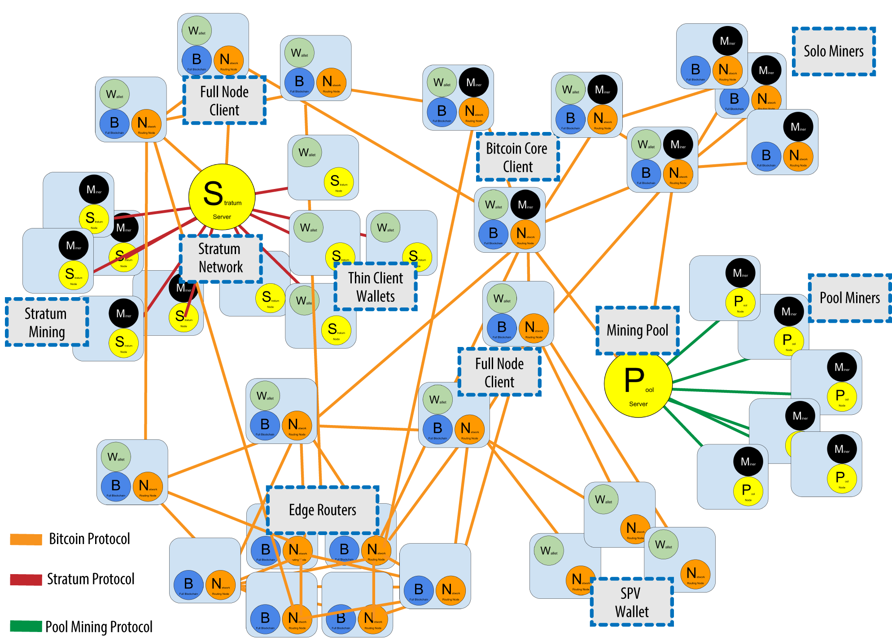

# The Bitcoin Network (Mạng lưới bitcoin)

## 1. Kiến trúc mạng ngang hàng (Peer-to-Peer Network Architecture)
* Bitcoin được cấu trúc như một kiến trúc mạng ngang hàng trên internet.
* Các nút tham gia vào mạng có vai trò ngang nhau, không có nút đặc biệt, không có máy chủ tập trung, không có cập bậc và có tính mở.
* Mạng bitcoin là tập hợp của các nút sử đụng giao thức bitcoin P2P.
* Mạng bitcoin mở rộng bao gồm giao thức bitcoin P2P, các giao thức của pool mining, giao thức Stratum  và các giao thức liên quan khác.

## 2. Các loại nút và vai trò (Node Types and Roles)
* Các node trong mạng lưới Blockchain ccos thể có vài trò khác nhau.

## 3. Mở rộng mạng lưới Bitcoin (The Extended Bitcoin Network)
* Các node:
    - Chạy các phiên bản client khác nhau (Bitcoin Core).
    - Dùng các giao thức P2P khác nhau.
    - Nhiều role (vai trò) khác nhau.
    
* Dựa trên các nên Bitcoin Core khác nhau, chúng ta có thể tạo ra rất nhiều ứng dụng khác nhau.

## 4. Mạng chuyển tiếp (Bitcoin Relay Networks)
* Do trong mạng P2P bitcoin sẽ phục vụ nhu cầu của nhiều loại nút khác nhau nên nó thể hiện độ trễ mạng quá cao đối với từng nhu cầu riêng biệt của các nút khai thác bitcoin.
* Do đó đòi hỏi các Miner (thợ mỏ) tham gia vào cuộc cạnh tranh làm giảm thời gian trễ đó.
* Một Bitcoin Relay Network là một mạng lưới sẽ cố gắng giảm thiểu độ trễ trong việc truyền tải khối giữa các thợ mỏ.

## 5. Network Discovery
* Khi một node mới xuất hiện:

    - Nó phải kết nối tới các node khác xung quanh (ít nhất là 1).
    - Thường sử dụng cổng 8333 TCP.
    - Không có node đặc biệt, nhưng một số node ổn định được list lại: seed nodes.
    - Khi kết nối thành công, nó gửi IP đến các node xung quanh, các node xung quanh lại gửi ra các node xung quanh khác.
    - Nó cũng có thể gửi thông điệp để lấy danh sách các peer của neighbor nó

## 6. Full node
* Chứa toàn bộ blockchain (Full blockchain nodes).
* Có thể build, verify một cách độc lập, nhưng vẫn phải kết nối tới network để update block mới.